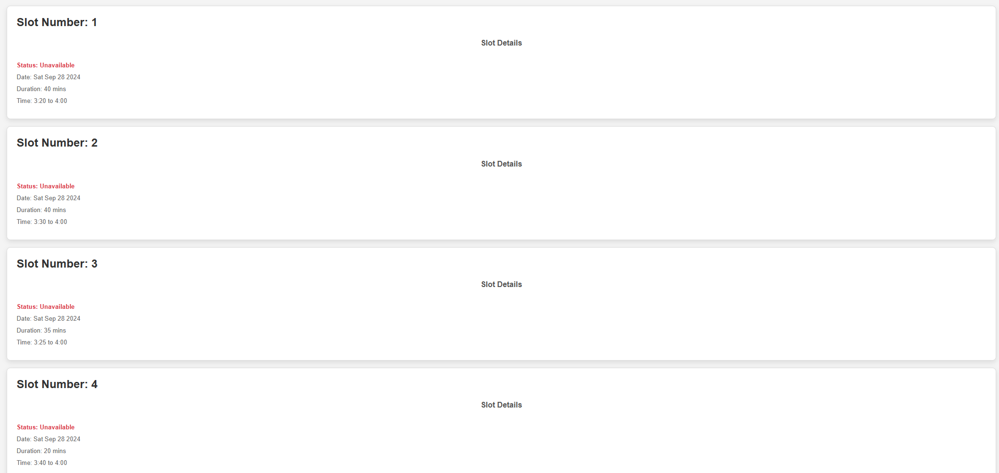
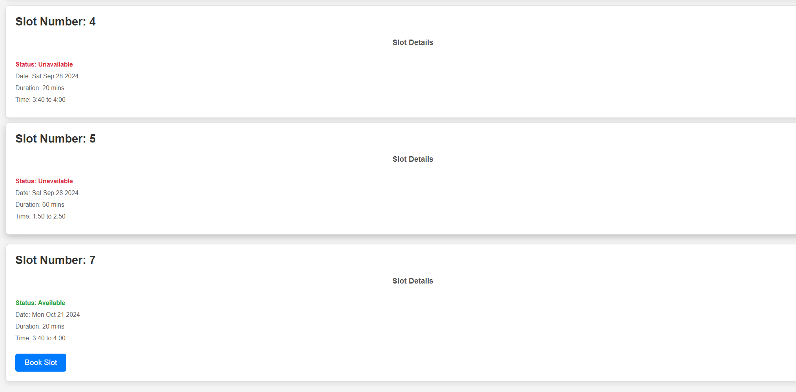
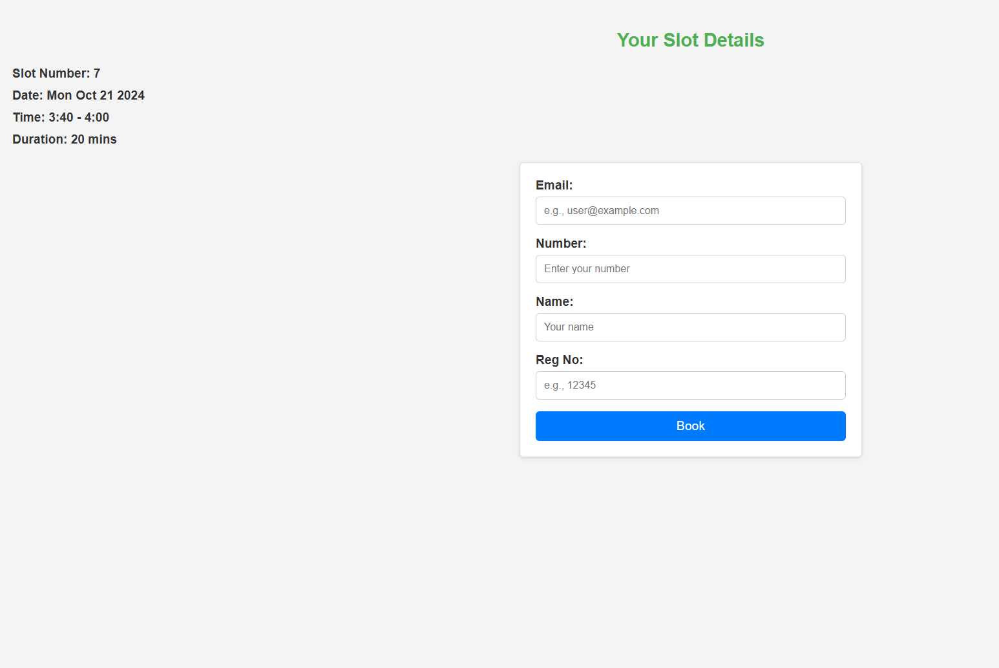
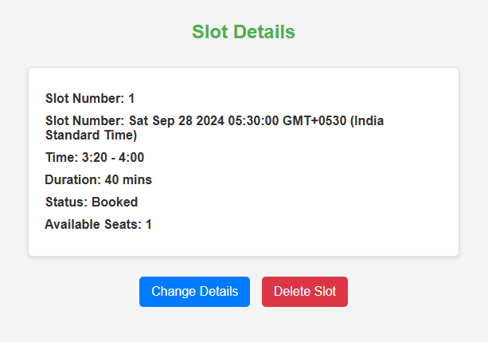
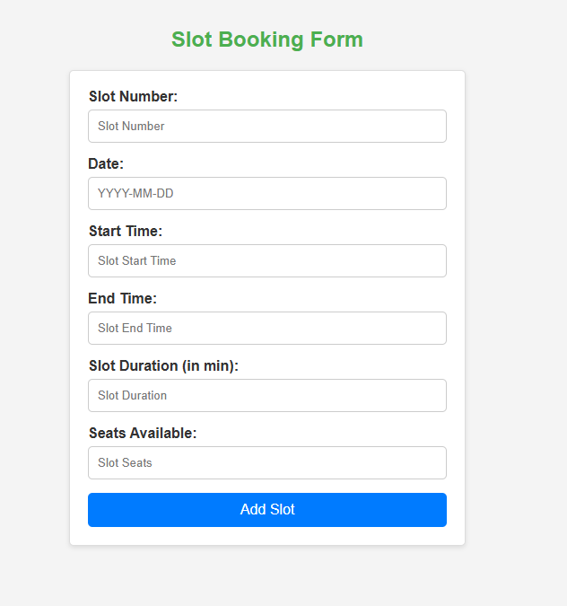
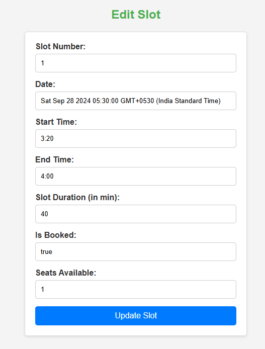
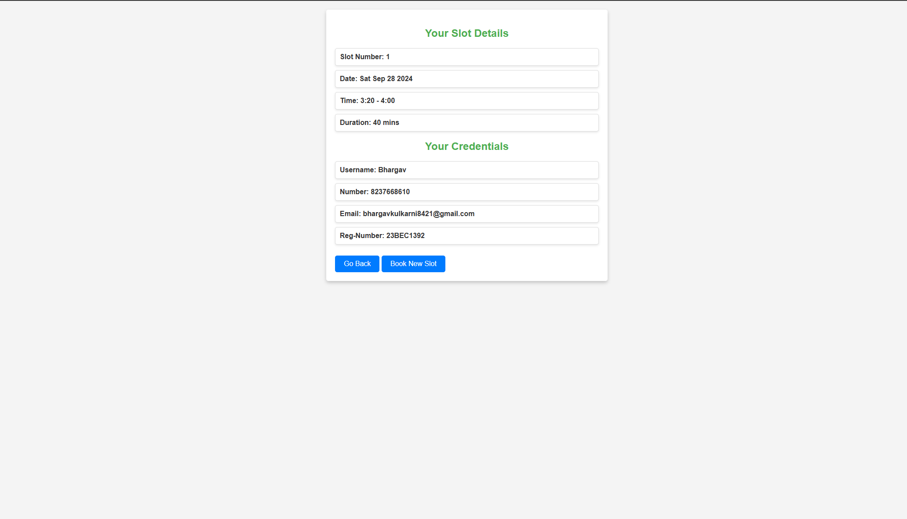

# Slot Booking System

## Overview
The Slot Booking System is a web application designed to facilitate the booking of scheduled time slots for users. It collects user details and allows them to book slots based on administrator-defined timelines. The system also features automated email reminders sent to users 10 minutes prior to their scheduled slots.

## Features

### 1. User Information Collection
- **Collects user details** including email, phone number, name, and registration number.

### 2. Slot Scheduling
- **Users can book available time slots** defined by the administrator.
  
  
  
  Book Available Slot
  

- **Duration constraints** can be set for each slot by the administrator.

### 3. Automated Reminder System
- **Sends automated email reminders** to users 10 minutes before their scheduled slot.

### 4. Administrator Interface
- **Allows administrators to manage** and define available slots and duration constraints.

  
  
  

### 5. User-Friendly Interface
- **Provides an intuitive interface** for users to book slots and receive confirmations.

  
  
## Technologies Used
- **Frontend:** HTML, CSS, JavaScript (or a framework like React, Vue, etc.)
- **Backend:** Node.js, Express.js
- **Database:** MongoDB 

## Limitations
The current implementation of the Slot Booking System does not have the following features:
- **Admin Authentication**
- **Client and Server-Side Data Validation**
- **Error Handling**
- **Cloud Database Integration**
- **Flexibility for Users to Modify Their Respective Slots**
- **Deployment** (Not yet deployed)

## ChatGPT Assistance
ChatGPT was utilized in the following areas of the project:
1. **Nodemailer and Cron Integration:** For setting up automated email reminders to users 10 minutes before their scheduled slot.
2. **Styling:** Assistance with front-end styling for a user-friendly interface.

## Future Enhancements
- Implementing admin authentication for secure access.
- Adding client and server-side data validation to enhance security.
- Improving error handling to provide better user feedback.
- Exploring cloud database options for improved scalability.
- Allowing users to modify their bookings.
- Deploying the application for public access.

## Installation
Instructions on how to install and run the Slot Booking System will be added here.

## Usage
Instructions on how to use the Slot Booking System will be added here.
